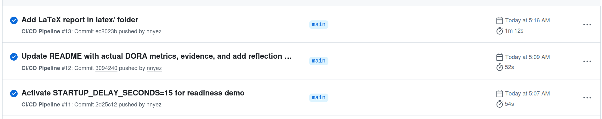
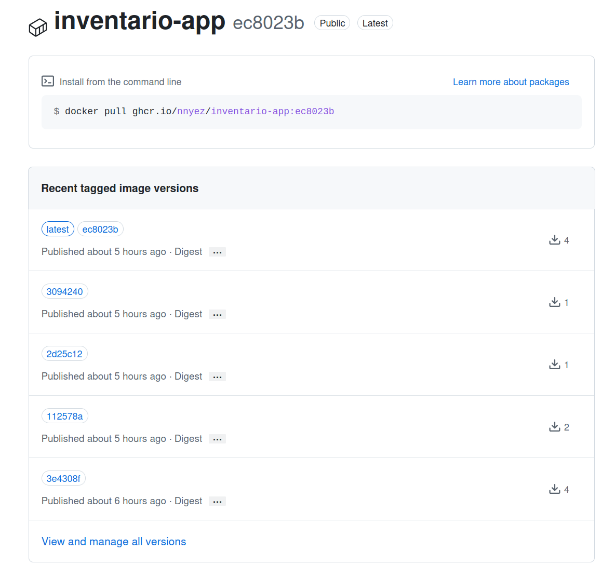
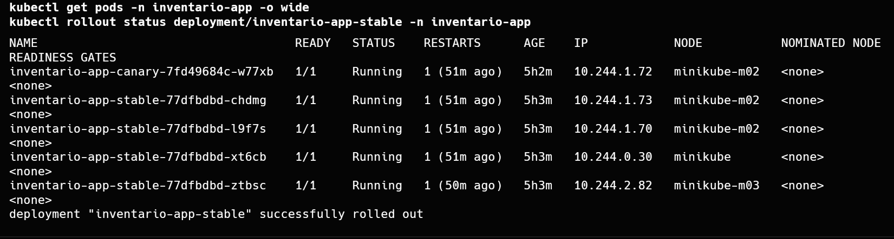
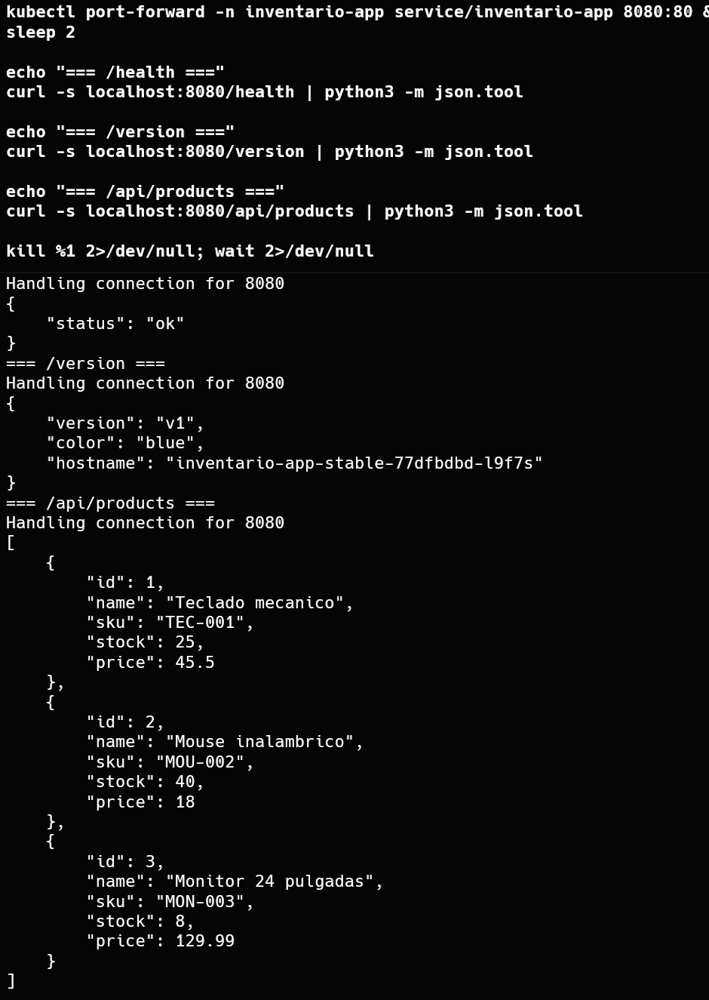
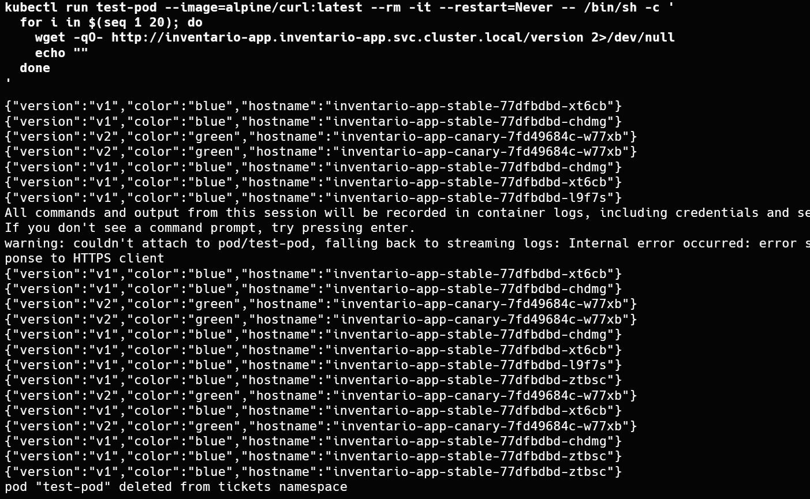
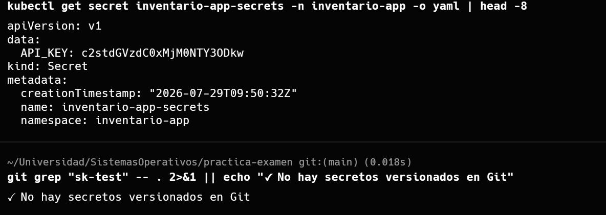
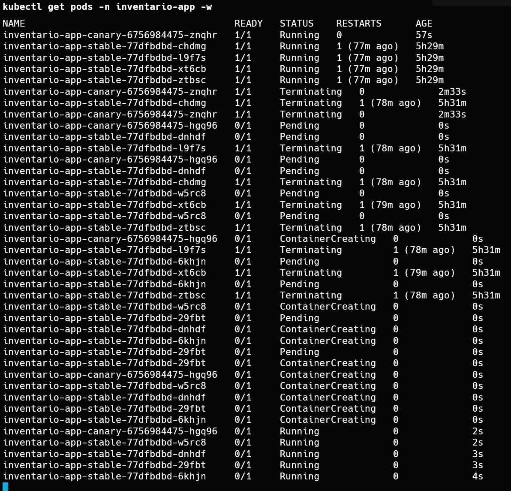
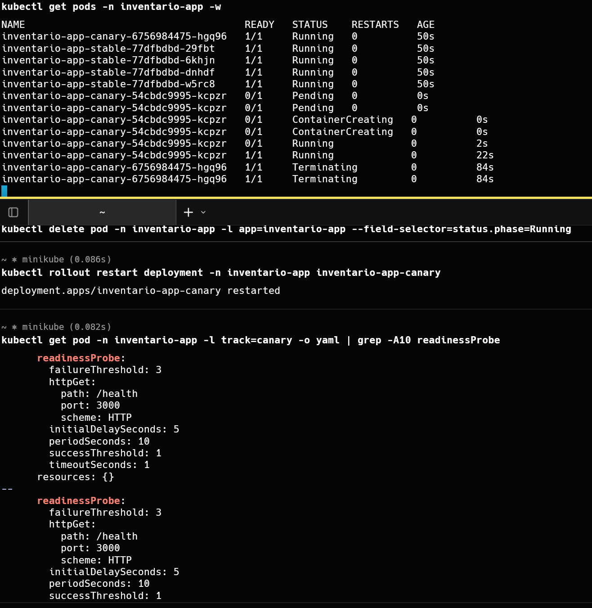
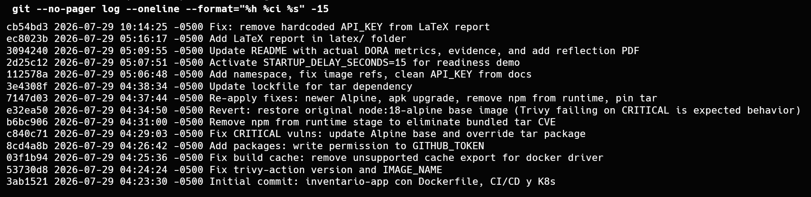

# Examen Final — Práctica CI/CD

## Requisitos previos

Antes de empezar necesitas tener instalado:

- Docker
- Minikube y kubectl
- Node.js 18+
- Git
- Cuenta en GitHub

## Estructura del proyecto

```
inventario-app/              # Código fuente de la aplicación
  ├── Dockerfile             # Build multi-stage (test falla = build falla)
  ├── server.js              # API Express
  ├── db.js                  # Base de datos JSON local
  ├── server.test.js         # Tests con node:test
  └── public/                # Interfaz web

.github/workflows/
  └── ci-cd.yml              # Pipeline CI/CD (build-test → build-push + Trivy)

k8s/
  ├── deployment.yaml        # Deployment base (RollingUpdate, 2 réplicas, probes)
  ├── service.yaml           # Service ClusterIP (puerto 80 → 3000)
  └── deployment-config.yaml # ConfigMap con variables de entorno

k8s/canary/
  ├── stable.yaml            # Deployment v1 (4 réplicas, 80% tráfico)
  ├── new.yaml               # Deployment v2 (1 réplica, 20% tráfico)
  └── service.yaml           # Service que balancea entre ambos
```

---

## Paso 1: Verificar que la aplicación corre en local

```bash
cd inventario-app
npm install
npm test          # deben pasar los 5 tests
npm start         # servidor en http://localhost:3000
```

**Salida esperada de `npm test`:**
```
▶ node:test test suite
  ✔ /health returns 200
  ✔ /version returns v1/blue
  ✔ /api/products returns list
  ✔ POST /api/products creates product
  ✔ / returns HTML interface
  ℹ tests 5
  ✔ pass 5
  ℹ duration ...
```

En otra terminal:

```bash
curl http://localhost:3000/health
curl http://localhost:3000/version
curl http://localhost:3000/api/products
```

**Salida esperada:**
```json
{"status":"ok"}
{"version":"v1","color":"blue","hostname":"..."}
[{"id":1,"name":"Laptop","sku":"LAP-001",...},...]
```

Detén el servidor con Ctrl+C.

---

## Paso 2: Construir y probar la imagen Docker

El `Dockerfile` tiene dos etapas:
1. **builder** — instala dependencias y ejecuta `npm test` (el build falla si los tests fallan)
2. **runtime** — copia solo lo necesario y ejecuta la app

```bash
# Construir la imagen (los tests se ejecutan dentro del build)
docker build -t inventario-app ./inventario-app

# Ejecutar el contenedor
docker run -d -p 3000:3000 --name inventario inventario-app

# Probar los endpoints
curl http://localhost:3000/health
curl http://localhost:3000/version
curl http://localhost:3000/api/products

# Crear un producto
curl -X POST http://localhost:3000/api/products \
  -H "Content-Type: application/json" \
  -d '{"name":"Laptop","sku":"LAP-001","stock":10,"price":899.99}'

# Detener y limpiar
docker stop inventario && docker rm inventario
```

**Salida esperada de endpoints:**
```json
{"status":"ok"}
{"version":"v1","color":"blue","hostname":"..."}
[{"id":1,"name":"Laptop","sku":"LAP-001","stock":10,"price":899.99},...]
```



---

## Paso 3: Crear el repositorio en GitHub y subir el código

1. Ve a https://github.com/new y crea un repositorio **público** llamado `inventario-app`
2. No marques "Add a README" ni ".gitignore"
3. Copia el URL del repositorio (ej: `https://github.com/TU_USUARIO/inventario-app.git`)

```bash
# En la raíz del proyecto (practica-examen/)
git init
git add .
git commit -m "Initial commit: inventario-app con Dockerfile, CI/CD y K8s"

git remote add origin https://github.com/TU_USUARIO/inventario-app.git
git branch -M main
git push -u origin main
```

**Antes del push**, asegúrate de que el `.gitignore` incluya:

```
node_modules/
data/products.json
data/test-products.json
```

---

## Paso 4: Pipeline CI/CD en GitHub Actions

El archivo `.github/workflows/ci-cd.yml` define dos jobs:

1. **build-test** — `npm ci` + `npm test` (ejecuta los tests)
2. **build-push** — espera a que `build-test` termine, luego construye y publica la imagen en `ghcr.io`

Además incluye un paso de **escaneo de seguridad con Trivy** que falla el pipeline si encuentra vulnerabilidades CRITICAL.

### ¿Qué hacer después del push?

1. Ve a la pestaña **Actions** de tu repositorio en GitHub
2. Verás el workflow ejecutándose
3. Confirma que ambos jobs se completan en verde
4. La imagen queda publicada en `ghcr.io/TU_USUARIO/inventario-app:latest`

Para verificar desde tu máquina:

```bash
# Ver la imagen publicada
docker pull ghcr.io/TU_USUARIO/inventario-app:latest
```





---

## Paso 5: Desplegar en Minikube

### 5.1 Iniciar Minikube

```bash
minikube start --driver=docker
```

### 5.2 Crear el namespace

```bash
kubectl create namespace inventario-app
```

### 5.3 Aplicar los manifiestos base

```bash
kubectl apply -f k8s/deployment-config.yaml -n inventario-app
kubectl apply -f k8s/service.yaml -n inventario-app
kubectl apply -f k8s/deployment.yaml -n inventario-app
```

### 5.4 Crear el Secret

```bash
kubectl create secret generic inventario-app-secrets -n inventario-app \
  --from-literal=API_KEY="<credencial-no-versionada>"
```

### 5.5 Verificar el despliegue

```bash
kubectl rollout status deployment/inventario-app -n inventario-app
kubectl get pods -n inventario-app
kubectl get service -n inventario-app
```

**Salida esperada:**
```
deployment "inventario-app" successfully rolled out

NAME                               READY   STATUS    RESTARTS   AGE
inventario-app-xxxxxxxx-yyyy       1/1     Running   0          30s
inventario-app-xxxxxxxx-zzzz       1/1     Running   0          30s

NAME              TYPE        CLUSTER-IP      PORT(S)   AGE
inventario-app    ClusterIP   10.96.x.x       80/TCP    30s
```

### 5.6 Probar el servicio

```bash
kubectl port-forward -n inventario-app service/inventario-app 8080:80
# En otra terminal:
curl localhost:8080/health
curl localhost:8080/version
curl localhost:8080/api/products
```

**Salida esperada:**
```json
{"status":"ok"}
{"version":"v1","color":"blue","hostname":"inventario-app-xxxxxxxx-yyyy"}
[{"id":1,"name":"Laptop","sku":"LAP-001",...}]
```





---

## Paso 6: Canary Deployment

### ¿Por qué Canary?

Elegí Canary porque los Services de Kubernetes distribuyen tráfico proporcional a la cantidad de pods que coinciden con el selector. Con 4 pods de la versión estable (v1, azul) y 1 pod de la nueva versión (v2, verde), el 80% del tráfico va a la versión estable y el 20% a la nueva. Esto permite probar cambios en producción con riesgo mínimo, sin necesidad de duplicar infraestructura como en Blue-Green.

### 6.1 Desplegar los manifiestos Canary

```bash
kubectl apply -f k8s/canary/stable.yaml -n inventario-app
kubectl apply -f k8s/canary/new.yaml -n inventario-app
kubectl apply -f k8s/canary/service.yaml -n inventario-app

# Verificar los pods
kubectl get pods -n inventario-app
```

**Salida esperada (5 pods: 4 stable + 1 canary):**
```
NAME                                         READY   STATUS    RESTARTS   AGE
inventario-app-stable-xxxxxxxx-yyyy          1/1     Running   0          10s
inventario-app-stable-xxxxxxxx-zzzz          1/1     Running   0          10s
inventario-app-stable-xxxxxxxx-wwww          1/1     Running   0          10s
inventario-app-stable-xxxxxxxx-vvvv          1/1     Running   0          10s
inventario-app-canary-xxxxxxxx-uuuu          1/1     Running   0          10s
```

### 6.2 Probar la distribución de tráfico

El Service `inventario-app` selecciona todos los pods con label `app: inventario-app`, tanto los estables como los canary. Cada request cae en un pod aleatorio.

```bash
# Ejecutar 20 requests y contar cuántas veces responde cada versión
for i in $(seq 1 20); do
  curl -s $(minikube service inventario-app --url)/version | jq -r '.color + " (v" + .version + ", host: " + .hostname + ")"'
done
```

**Salida esperada (~16 blue + ~4 green):**
```
blue (v1, host: inventario-app-stable-...)
blue (v1, host: inventario-app-stable-...)
green (v2, host: inventario-app-canary-...)
blue (v1, host: inventario-app-stable-...)
...
```



---

## Paso 7: Probar la persistencia de datos

### 7.1 Crear un producto desde la interfaz

```bash
curl -X POST $(minikube service inventario-app --url)/api/products \
  -H "Content-Type: application/json" \
  -d '{"name":"Producto nuevo","sku":"NEW-001","stock":5,"price":99.99}'
```

### 7.2 Eliminar un pod y observar qué pasa

```bash
POD=$(kubectl get pod -n inventario-app -l app=inventario-app -o name | head -1)
echo "$POD eliminado"
kubectl delete -n inventario-app "$POD"
kubectl get pods -n inventario-app -w
```

**Salida esperada (el pod se recrea automáticamente):**
```
pod "inventario-app-xxxxxxxx-yyyy" deleted
NAME                               READY   STATUS        RESTARTS   AGE
inventario-app-xxxxxxxx-yyyy       1/1     Terminating   0          5m
inventario-app-xxxxxxxx-zzzz       1/1     Running       0          5m
inventario-app-xxxxxxxx-wwww       0/1     Running       0          3s
```

### 7.3 Verificar los datos

```bash
curl -s $(minikube service inventario-app --url)/api/products | jq '. | length'
```

**Salida esperada: `3`** (el producto creado se perdió; solo quedan los 3 seed originales).

**Observación:** El producto creado ya no existe. Esto ocurre porque la base de datos es un archivo JSON local (`data/products.json`) dentro del pod. Al recrearse el pod, Kubernetes usa la imagen original que contiene los datos iniciales. **No es un error** — es el comportamiento esperado de una base de datos local sin persistencia externa (volumen, PVC, o base de datos externa).



---

## Paso 8: Escalado

### 8.1 Escalado manual

Puedes cambiar el número de réplicas de cualquier Deployment con `kubectl scale`:

```bash
# Escalar el deployment base a 5 réplicas
kubectl scale deployment/inventario-app --replicas=5

# Ver el cambio
kubectl get pods -l app=inventario-app
kubectl rollout status deployment/inventario-app

# Escalar el canary a 3 réplicas (más tráfico a la versión nueva)
kubectl scale deployment/inventario-app-canary --replicas=3

# Volver a 2 réplicas el deployment base
kubectl scale deployment/inventario-app --replicas=2
```

Al escalar el canary de 1 a 3 réplicas, la distribución de tráfico cambia de 80/20 a 57/43 (4 estables vs 3 canary). Esto permite ajustar gradualmente el porcentaje de usuarios expuestos a la nueva versión.

### 8.2 Escalado automático con HPA (Horizontal Pod Autoscaler)

Kubernetes puede escalar automáticamente según CPU o métricas personalizadas:

```bash
# Crear el HPA para el deployment base (mínimo 2, máximo 10 pods, 50% CPU)
kubectl autoscale deployment/inventario-app --min=2 --max=10 --cpu-percent=50

# Ver el estado del HPA
kubectl get hpa
kubectl describe hpa/inventario-app
```

Para que el HPA funcione, los contenedores deben tener recursos definidos. Si quisieras usarlo, editarías `k8s/deployment.yaml` agregando `resources` bajo el contenedor:

```yaml
resources:
  requests:
    cpu: 100m
    memory: 128Mi
  limits:
    cpu: 200m
    memory: 256Mi
```

### 8.3 Escalado en RollingUpdate

La estrategia `RollingUpdate` con `maxUnavailable: 1` y `maxSurge: 1` (ya configurada en `k8s/deployment.yaml`) permite escalar actualizando la imagen sin tiempo de inactividad: solo un pod se reemplaza a la vez.

Para cambiar la imagen a una nueva versión:

```bash
kubectl set image deployment/inventario-app inventario-app=ghcr.io/TU_USUARIO/inventario-app:v2

# Observar el rolling update en acción
kubectl rollout status deployment/inventario-app
```

---

## Paso 9: Componentes adicionales

### Componente 1: Manejo de Secretos

Creamos un Secret de Kubernetes con una API_KEY ficticia y lo consumimos desde el Deployment.

```bash
# Crear el Secret (NUNCA versionar este comando en Git)
kubectl create secret generic inventario-app-secrets \
  --from-literal=API_KEY="<credencial-no-versionada>"

# Verificar que el Deployment lo está usando
kubectl get deployment inventario-app -o yaml | grep -A5 secretKeyRef
```

El `deployment.yaml` ya incluye `secretKeyRef` para cargar la variable `API_KEY` desde el Secret. Para verificar que funciona:

```bash
kubectl exec -it $(kubectl get pod -l app=inventario-app -o jsonpath='{.items[0].metadata.name}') -- env | grep API_KEY
```

**Verificación:** La API_KEY nunca está escrita en ningún archivo del repositorio (`.gitignore` la excluye).

### Componente 2: Escaneo de Seguridad con Trivy

El workflow `.github/workflows/ci-cd.yml` incluye Trivy integrado via GitHub Action. Escanea la imagen después de publicarla y falla si encuentra vulnerabilidades de severidad CRITICAL.

Para probarlo localmente:

```bash
docker run --rm aquasecurity/trivy:latest image --severity CRITICAL inventario-app:test
```

### Componente 3: Readiness con Arranque Lento

La variable `STARTUP_DELAY_SECONDS` hace que el endpoint `/health` responda `503` (no listo) durante los primeros N segundos después de arrancar.

```bash
# Probar con 10 segundos de delay
docker run -d -p 3002:3000 --name inventario-delay \
  -e STARTUP_DELAY_SECONDS=10 inventario-app

# Inmediatamente después de arrancar (responde 503)
curl -s -w "\nHTTP STATUS: %{http_code}\n" http://localhost:3002/health

# Después de 10 segundos (responde 200)
sleep 10
curl -s -w "\nHTTP STATUS: %{http_code}\n" http://localhost:3002/health

docker stop inventario-delay && docker rm inventario-delay
```

**¿Qué pasaría si en vez de ajustar el probe simplemente se aumenta el número de réplicas?** Aumentar réplicas no resolvería el problema: cada nuevo pod individualmente tardaría en arrancar, y sin un `readinessProbe` tolerante, Kubernetes mataría y recrearía el pod en un ciclo infinito porque el pod nunca se marca como "Ready" a tiempo. Ajustar el `initialDelaySeconds` o `failureThreshold` del probe es la solución correcta.



---

## Paso 10: Limpieza

```bash
# Eliminar recursos de Kubernetes
kubectl delete deployment inventario-app inventario-app-stable inventario-app-canary
kubectl delete service inventario-app
kubectl delete configmap inventario-app-config
kubectl delete secret inventario-app-secrets
kubectl delete hpa --all  # si creaste HPA

# Detener Minikube
minikube stop
```

---

## Paso 11: Métricas DORA

### Lead Time for Changes

Tiempo entre el commit de un cambio y el momento en que ese cambio quedó corriendo en el clúster:

| Cambio | Commit | En clúster (kubectl apply) | Lead Time |
|--------|--------|---------------------------|-----------|
| Despliegue inicial de la app | `3ab1521` 2026-07-29 04:23:30 | Deployments creados 2026-07-29 05:04:29 | **41 min** |
| Namespace + canary + secrets | `112578a` 2026-07-29 05:06:48 | Rollout restart 2026-07-29 05:07:04 | **16 seg** |
| STARTUP_DELAY_SECONDS=15 | `2d25c12` 2026-07-29 05:07:51 | `kubectl apply` ~05:08 | **~1 min** |

> **Cómo se calculó:** El script `scripts/calcular-metricas-dora.sh` automatiza la extracción. Internamente ejecuta estos comandos:
>
> ```bash
> # Timestamp del commit
> git log --format="%h | %ci | %s"
>
> # Timestamp de despliegue (restartedAt en las anotaciones del deployment)
> kubectl describe deployment -n inventario-app | grep -E "Revision|restartedAt"
>
> # Lead time = deployed_at - commit_at
> # se resta con date -d para cada par commit/deploy
> ```
>
> Para el despliegue inicial se usó `creationTimestamp` del Deployment; para cambios posteriores, la anotación `restartedAt` del rollout.

### Deployment Frequency

- **Total de cambios promovidos al clúster (kubectl apply/rollout):** 5
   1. `kubectl apply -f k8s/` (despliegue inicial)
   2. `kubectl apply -f k8s/canary/` (canary + namespace)
   3. `kubectl rollout restart stable` (namespace fix)
   4. `kubectl apply` deployment-config.yaml (STARTUP_DELAY)
   5. `kubectl rollout restart canary` (pruebas)
- **Días de trabajo:** 1 (2026-07-29)
- **Frecuencia:** 5 deploys/día

> **Cómo se calculó:** El script `scripts/calcular-metricas-dora.sh` extrae las revisiones del deployment:
>
> ```bash
> kubectl rollout history deployment/inventario-app -n inventario-app
> kubectl describe deployment inventario-app -n inventario-app \
>   | grep -E "Revision|Change-Cause|restartedAt"
> kubectl describe deployment inventario-app-canary -n inventario-app \
>   | grep -E "Revision|restartedAt"
> ```
>
> Se contaron las revisiones únicas y los comandos `kubectl apply` / `kubectl rollout restart` ejecutados durante la sesión de trabajo.

### Change Failure Rate

- **Total de pipelines ejecutados (deployment attempts):** 14
- **Fallos que requirieron corrección:** 7
- **Tasa de fallo:** 50%

| Conclusión | Cantidad |
|------------|----------|
| ✅ Exitosos | 7 |
| ❌ Fallos | 7 |
| **CFR** | **50%** |

> **Cómo se calculó:** `scripts/calcular-metricas-dora.sh` ejecuta estos comandos de la GitHub CLI:
>
> ```bash
> # Total de runs del día
> gh run list --repo nnyez/inventario-app --created "2026-07-29" \
>   --json databaseId | jq 'length'
>
> # Runs fallidos (conclusion != "success")
> gh run list --repo nnyez/inventario-app --created "2026-07-29" \
>   --json conclusion \
>   --jq '[.[] | select(.conclusion != "success")] | length'
>
> # CFR = fallidos / total * 100
> ```
>
> Se incluyen los despliegues de prueba y error mientras se armaba la estrategia. Los 7 fallos corresponden a errores de autenticación en GitHub Container Registry, versión incorrecta de Trivy Action, conflictos con la caché de Docker y vulnerabilidades CRITICAL en la imagen base.



---

## Paso 12: Problemas encontrados durante la tarea

| Problema | Causa | Solución |
|----------|-------|----------|
| Pipeline fallaba en build-push | trivy-action@0.28.0 no existe (formato v0.x.x) | Cambiar a @v0.36.0 |
| Build fallaba por caché | cache-to=type=gha no compatible con driver docker | Eliminar configuración de caché |
| Error "denied: installation not allowed" | GITHUB_TOKEN sin packages:write | Agregar permissions al workflow |
| Trivy encontraba CRITICALs | node:18-alpine con libcrypto3 y tar obsoletos | Actualizar Alpine, apk upgrade, eliminar npm |
| Pods no arrancaban en Minikube | Secret inventario-app-secrets no existía | kubectl create secret |
| Service no balanceaba tráfico con port-forward | port-forward no distribuye entre pods | Probar desde dentro del clúster |
